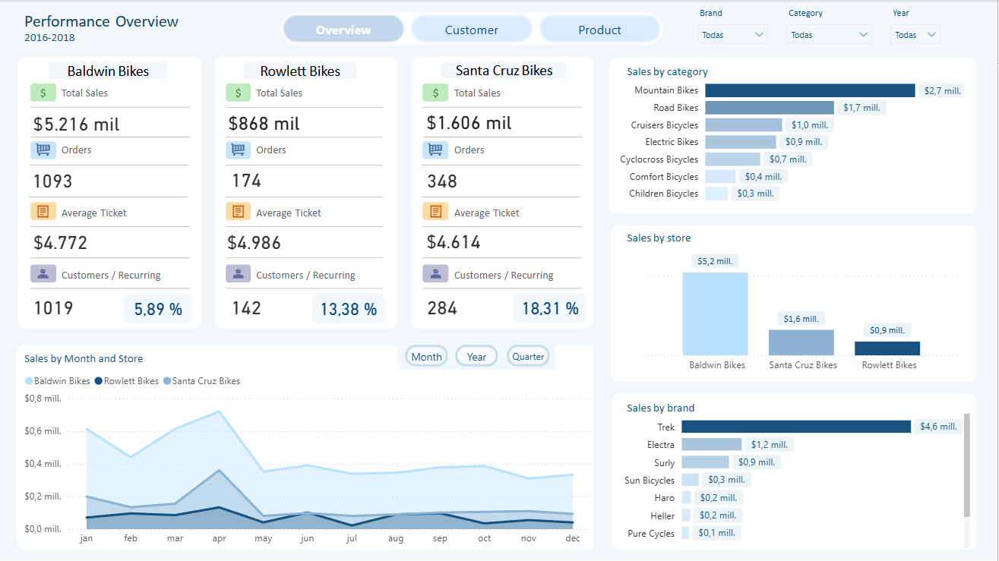
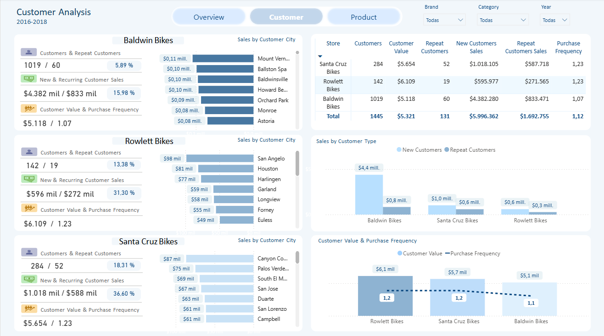
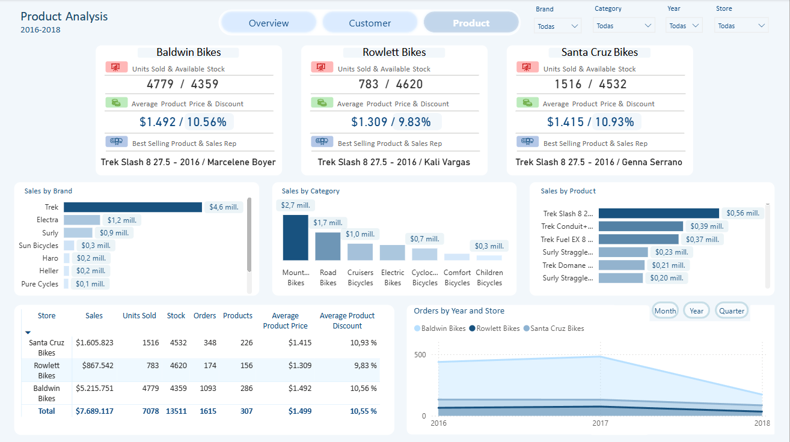

# Análisis de Ventas - BikesStores
Proyecto de análisis de ventas desarrollado con SQL Server y Power BI para evaluar el desempeño de cada sucursal e identificar los factores que influyen en sus ventas. Incluye modelado de datos, medidas DAX, KPIs y dashboards interactivos para apoyar la toma de decisiones.

## Dataset
Se utilizó el dataset público **BikeStores**, el cual simula las operaciones comerciales de una empresa dedicada a la venta de bicicletas y accesorios.

Contiene archivos de:
- Ventas
- Clientes
- Productos
- Categorías
- Marcas
- Inventario
- Vendedores
- Sucursales

## 1. Objetivo
Identificar los factores que afectan el desempeño comercial de las sucursales de BikeStores mediante el análisis de ventas, clientes, categorías, marcas, inventario y vendedores, utilizando SQL Server y Power BI.

## 2. Herramientas utilizadas
- SQL Server
- SQL Server Management Studio (SSMS)
- Power BI
- Power Query
- DAX

## 3. Preguntas de negocio
- ¿Cuáles son los ingresos, la cantidad de órdenes y el ticket promedio de cada sucursal?.
- ¿Cuál es el ingreso promedio generado por cliente en cada sucursal?.
- ¿Cuántas órdenes realiza en promedio cada cliente?.
- ¿Cuántos clientes realizaron una segunda compra o más en cada sucursal?.
- ¿Qué tipo de clientes generan mayores ingresos en cada sucursal, clientes nuevos o recurrentes?.
- ¿Los ingresos de cada sucursal provienen principalmente de un grupo reducido de ciudades?.
- ¿Qué categorías representan la mayor participación de los ingresos en cada sucursal?.
- ¿Qué marcas representan la mayor participación en los ingresos de cada sucursal?.
- ¿Las diferencias de desempeño entre sucursales pueden estar relacionadas con la disponibilidad de productos?.
- ¿Qué porcentaje de las ventas aporta cada vendedor dentro de su sucursal?.

## 4 Metodología
1. Exploración de datos.
2. Realizar consultas SQL para responder las preguntas de negocio.
3. Conexión de SQL Server con Power BI, creación de tablas en Power Query y modelado de datos (esquema estrella).
4. Creación de medidas DAX.
5. Diseño de dashboards interactivos.
6. Obtención de conclusiones.

## 5. Consultas SQL
Las consultas SQL fueron desarrolladas para responder cada una de las preguntas de negocio planteadas durante el análisis.
📄 **Archivo completo:** [analisis_bikestore.sql](SQL/analisis_bikestore.sql)

Las consultas incluyen:
- Panorama general de ventas.
- Análisis de clientes.
- Análisis de categorías.
- Análisis de marcas.
- Análisis de inventario.
- Análisis de vendedores.
- Análisis por ciudades.

## 6. Power BI Dashboard
Presentación del archivo Power BI.

### 6.1 Modelado de datos
Se modificó el modelo de SQL a un modelo estrella para facilitar el análisis en Power BI. El modelo está compuesto por una tabla de hechos (Ventas) y las dimensiones de Productos, Clientes, Tiendas, Vendedores, Marcas, Categorías y Calendario.

### 6.2. Panorama General
Presentar una visión resumida del desempeño comercial de las sucursales.

### 6.3. Análisis Clientes
Analizar el comportamiento de los clientes mediante indicadores de valor, frecuencia de compra y recompra.

### 6.4. Análisis Productos
Evaluar el desempeño de productos, categorías, marcas e inventario.

## 7. Hallazgos principales / Conclusiones

- Baldwin Bikes obtuvo el mayor nivel de ingresos, la mayor cantidad de órdenes y el mayor número de cliente en los periodos analizados.
- Existe una oportunidad de fortalecer la fidelización de clientes, ya que los clientes recurrentes (con dos o más compras) representan menos del 20% del total de clientes en las tres sucursales. Además, generan menos del 38% de los ingresos, mientras que los clientes nuevos aportan aproximadamente el 72%, lo que indica una alta dependencia de la captación constante de nuevos clientes.
- Lo anterior se ve respaldado por la frecuencia promedio de compra, que es cercana a 1,17 órdenes por clientes en las tres sucursales, evidenciando una baja recurrencia de compra por parte de los clientes.
- La marca Trek concentra aproximadamente el 50% de los ingresos, mientras que la categoría Mountain Bikes representa cerca del 30% de las ventas en las tres sucursales. La distribución de marcas y categorías son muy similares para cada sucursal, por lo que no constituye un factor diferenciador del desempeño comercial.
- El inventario tampoco explica las diferencias observadas entre sucursales. Tanto el stock por categorías como por marcas presenta una distribución similar, con diferencias mínimas en la disponibilidad de productos.
- La participación de las ventas se encuentra distribuida de forma equilibrada entre los vendedores y tampoco existe una alta concentración de ingresos en un grupo específico de ciudades dentro de cada sucursal.
- El mejor desempeño comercial de Baldwin Bikes no parece estar asociado a diferencias en marcas, categorías, clientes, inventario o distribución de vendedores. En cambio, la sucursal presenta un mayor alcance geográfico, atendiendo clientes provenientes de 134 ciudades, mientras que las demás sucursales atienden clientes de menos de 50 ciudades. Este mayor alcance constituye un factor que podría contribuir a explicar su mayor volumen de clientes, órdenes e ingresos.
